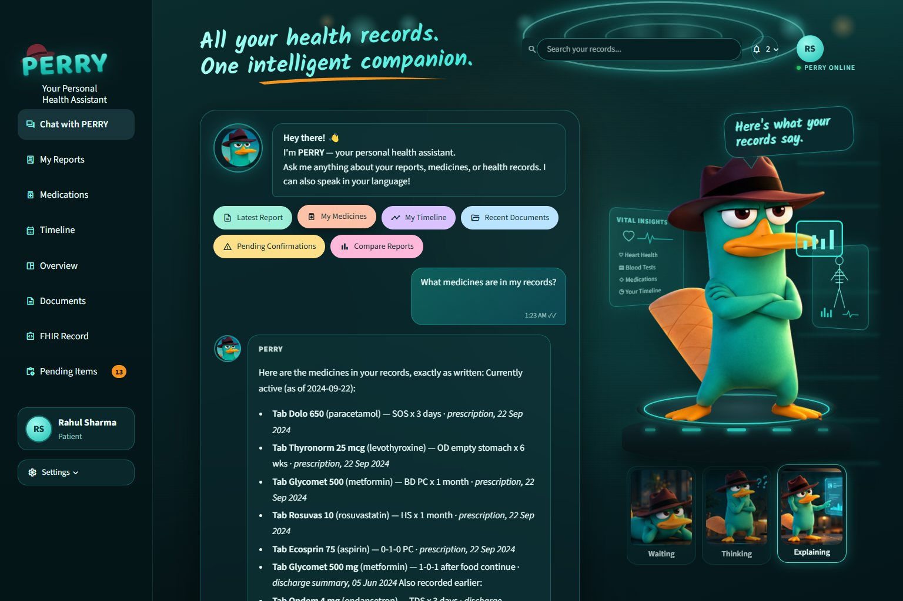
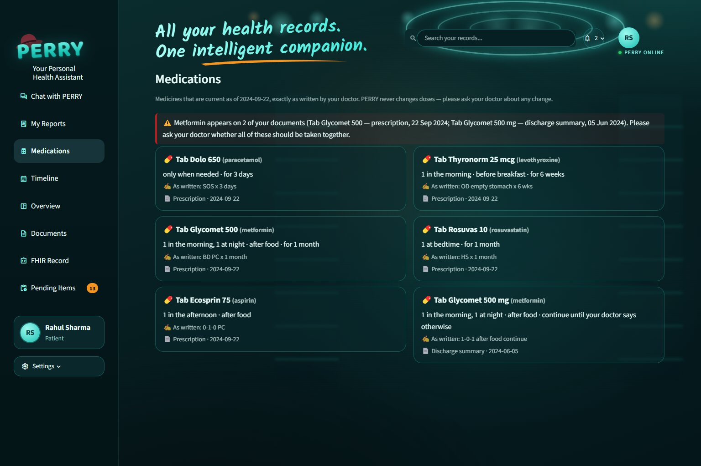
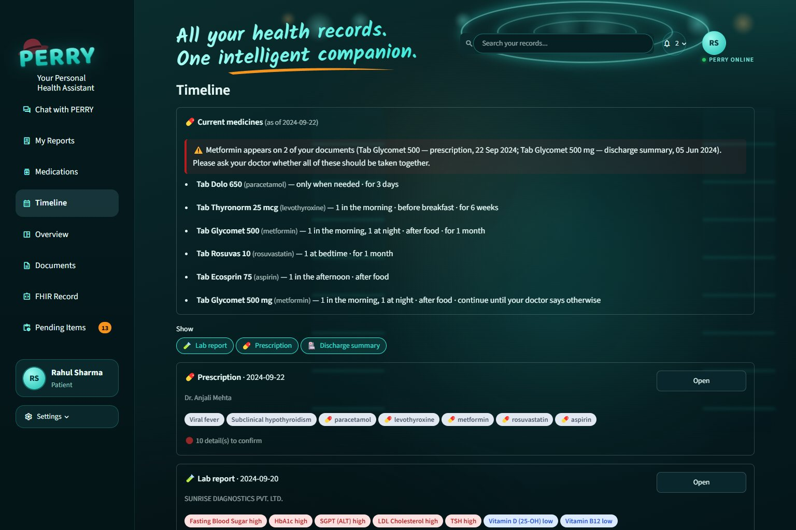

# PERRY — Your Personal Health Assistant

**All your health records. One intelligent companion.**

Snap a lab report, prescription or discharge summary and PERRY gives you:
- verified structured data;
- an ABDM-ready FHIR R4 record;
- a plain-language summary in English and Hindi;
- one timeline of your health;
- a chat and voice assistant that answers questions about *your own* records in 13 languages: English, Hinglish and 11 Indian languages.

Everything runs locally, with no cloud APIs.

Built for the Altrix Labs "AI-Powered Personal Health Copilot" hackathon. The project began as **ByteXL**, and that is still
the repository, package and API name; PERRY is the product users see.



| Medications | Timeline |
|---|---|
|  |  |

## Setup (≤ 10 commands)

Requires Python 3.11 and [Ollama](https://ollama.com). MongoDB is optional; without it ByteXL stores data as JSON files automatically.

```bash
git clone https://github.com/Yash-200608/ByteXL.git && cd ByteXL
python3.11 -m venv .venv && .venv/bin/pip install -r requirements.txt
cp .env.example .env
ollama pull qwen2.5vl:3b && ollama pull qwen2.5:7b
ollama pull hf.co/fischerman/sarvam-translate-gguf:Q4_K_S   # PERRY in 10+ Indian languages (optional, ~2.4 GB)
docker compose up -d mongo            # optional
make seed                             # demo patient + all files in samples/ (slow on CPU-only machines)
make api                              # terminal 1 → http://localhost:8000/docs
make ui                               # terminal 2 → http://localhost:8501
```

On a GPU machine set `VISION_MODEL=qwen2.5vl:7b` in `.env` for better accuracy. For an instant, LLM-free demo use
`EXTRACTION_MODE=rules SUMMARY_MODE=template make seed` (every field then lands in the confirm queue).

Other commands: `make test` (pytest), `make eval` (field-level accuracy), `make samples` (regenerate synthetic samples).

### Windows

`run.ps1` replaces the Makefile: `.\run.ps1 setup`, `.\run.ps1 seed`, `.\run.ps1 test`, and `.\run.ps1 demo`, which opens the API, the UI and, if Ollama is not running, the mock below in separate windows. Use `.\run.ps1 stop` to close them.

### Mock Ollama (machines that cannot run the models)

`scripts/mock_ollama.py` is a stand-in that serves Ollama's `/api/tags` and `/api/chat` on port 11434. It is **not a model**. For the five bundled samples it replays their reference answers from `tests/fixtures/synthetic_truth/`. For any other document it answers with the rules extractor. Summaries are composed from the validated JSON and still go through every safety check. OCR, normalization, FHIR and the UI all run for real. Health reports `mock-ollama:stand-in` among the installed models. Stop the mock and start real Ollama before the eval numbers or a live demo mean anything.

## Live demo and deployment

PERRY is built to run on the user's own device, so health data never leaves it. That shapes how it is shared:

- **Cloud demo (always on):** hosted free on Streamlit Community Cloud, with the synthetic demo patient pre-loaded.
  - The entry point is `ui/cloud_app.py`. It starts the API inside the Streamlit process, copies `deploy/demo_data/` in
    on first start, and switches PERRY to its no-GPU fallbacks: rules extraction, template summaries, and the rule-based
    chat router, with all safety checks still applied.
  - Its lighter dependency list is `ui/requirements.txt`; PaddleOCR and Whisper are left out, so photo OCR and on-device
    voice recognition are off in the cloud.
  - A banner on every page explains this; the `DEMO_NOTICE` setting holds its text.
  - Deploy: on share.streamlit.io choose this repository, set the main file to `ui/cloud_app.py`, and pick Python 3.12.
  - The same cloud mode also runs as a Docker image (`Dockerfile`, port 7860) on hosts that accept Docker, including the
    full OCR stack.
- **Full version with live AI:** run PERRY on a machine with Ollama and the models (`.\run.ps1 demo`), then run
  `.\deploy\share.ps1`. It opens a public HTTPS link to that machine through Tailscale Funnel; Funnel must be allowed once
  in the Tailscale admin console. The link works while the machine is on; `.\deploy\share.ps1 -Stop` closes it.
- **Self-hosted:** `docker build -t perry . && docker run -p 7860:7860 perry`. Remove the demo `ENV` lines and set
  `OLLAMA_URL` to an Ollama server to use the real models.

Only synthetic data belongs on a public link: the app has no login, so anyone with the URL can see and upload.

## Architecture


Green steps are deterministic Python, orange steps use a local LLM. The principle: **LLMs read and write words; Python decides facts.** Full design — schemas, normalization rules, FHIR mapping, Mongo collections, API contract, safety design — is in [docs/architecture.md](docs/architecture.md).

| Layer | Tech |
|---|---|
| Ingest & OCR | PyMuPDF text layer → 200 DPI raster + PaddleOCR (PP-OCRv5 mobile) with deskew/contrast |
| Extraction | Ollama `qwen2.5vl` (page image + OCR text) with JSON-schema-constrained output, Pydantic validation, one retry with error feedback, rules fallback |
| Normalization | 51 lab tests → LOINC + sex-specific ranges + unit conversion, 103 Indian brands → generics, Indian dosing grammar parser |
| Health record | FHIR R4 (`fhir.resources`, R4B wire-compatible) collection Bundle per upload, NRCeS profile tags, ABDM document-bundle export |
| Summary | `qwen2.5:7b` prose from validated JSON only, deterministic safety checks, template fallback |
| Store / API / UI | MongoDB or JSON files · FastAPI · Streamlit |

## Features

- **Upload anything common**: text PDFs, scanned PDFs, phone photos (JPG/PNG). Per-stage progress in the UI.
- **Automatic document type** (lab report / prescription / discharge summary): keyword rules with an LLM fallback.
- **Structured extraction with provenance**: every field has a confidence score and the exact box it came from on the page; tap a value to see the crop.
- **Indian prescriptions understood**: `1-0-1`, `½-0-½`, `OD/BD/TDS/QID`, `SOS`, `HS`, `AC/PC`, "empty stomach", "x 5 days", "for 1 week", "once a week", "continue" → structured schedule; brand → generic (Glycomet → metformin).
- **Lab values checked in Python**: printed reference range first, reference-table fallback by sex, mmol/L ↔ mg/dL conversion for glucose and lipids, low / normal / high / critical / unknown.
- **Confirm queue**: low-confidence fields, values not found on the page, flag mismatches, unrecognised tests/medicines, and *every* drug name and dose on handwritten prescriptions need one-tap confirmation. Edits rebuild the FHIR record, trends and summary.
- **Plain-language summary in English and Hindi** (English written by the local LLM under safety checks; Hindi composed from curated Hindi phrases by default): what the document is, key findings, out-of-range values and what they generally indicate, medicines and how to take them *as written*, questions to ask your doctor, fixed disclaimer.
- **Unified timeline and trends**: all documents chronologically; any test over time with the reference band shaded; current medicines with duplicate-medicine alerts ("Metformin appears on 2 of your documents — ask your doctor").
- **ABDM-ready**: mock ABHA number (Verhoeff-valid `91-XXXX-XXXX-XXXX`) and ABHA address on every patient, link-existing-ABHA flow, one-click FHIR export.

## The PERRY interface

- **Layout:** a dark-teal glass dashboard in three columns, with the bundled Kalam and Baloo 2 fonts (OFL), so it works offline.
  - **Sidebar:** PERRY logo; 8 pages (Chat with PERRY, My Reports, Medications, Timeline, Overview, Documents, FHIR Record,
    Pending Items, with a count badge); user card; Settings (profile switcher, model status).
  - **Header:** tagline; "Search your records…" (the search goes through PERRY's own record search); notifications for
    pending confirmations, duplicate medicines and documents still being read; "PERRY ONLINE" status.
  - **Chat panel:**
    - Welcome block and six quick actions: Latest Report, My Medicines, My Timeline, Recent Documents, Pending
      Confirmations, Compare Reports.
    - Timestamped bubbles; High / Low / Normal value tags.
    - Source cards that open the exact document in My Reports; 👍 / 👎 feedback.
    - A composer with 📎 attach and 🎙️ mic.
    - A reply-language picker (auto-detect or pick one of 13) and a **Speak with PERRY** menu for voice settings.
  - **Avatar column:** PERRY on a glowing platform with hologram panels, a speech bubble and three live state cards.
- **One avatar state machine** (`ui/perry_state.py`), driven by what is really happening:

  | State | When | On screen |
  |---|---|---|
  | Waiting | idle | arms crossed, "Ready when you are!" |
  | Listening | the mic is recording | pulsing rings |
  | Thinking | a voice question is being transcribed, or a question is being understood | `?` marks |
  | Searching | PERRY is querying your records | magnifier over a document |
  | Speaking | the browser is reading the answer aloud | sound waves |
  | Explaining | an answer was just given | hologram chart |
  | Celebrating | an upload succeeded | confetti |
  | Confused | something failed | orange alert, "let's try that again" |

  The server sets the state in the session. Listening and speaking come from the browser itself (the mic button and the
  speech engine's start/end events), so the animation matches real activity. Transitions are validated, so
  Waiting → Explaining, for example, is rejected. Animations respect `prefers-reduced-motion`.
- **Mascot art:** the PERRY images in `ui/static/perry/` are fan-art placeholders inspired by Disney's Perry the
  Platypus, used for this non-commercial hackathon demo only. Replace them before any public or commercial use.

## PERRY — the assistant

PERRY is the app's home page: a chat assistant that answers questions about the selected user's own records in English, Hindi
(Devanagari) or Hinglish, for example "What changed in my health records?", "Meri latest report samjhao", or "Which medicine was
prescribed most recently?". It lives in `app/agent/` and reuses the existing record services. It has no database of its own.

- **User-scoped tools only.** The app binds a tool set to the current user (`PerryTools(patient_id)`). The model only picks a tool name
  and its arguments, which are checked against strict schemas that reject extra fields. It can't pass or change a user ID, read
  another user's documents, or run queries, code or shell commands.
- **Tools:**
  - `get_my_overview`, `search_my_records` (fuzzy search across labs, medicines, diagnoses, documents, advice, summaries and
    confirmations)
  - `get_my_labs`, `compare_my_reports`, `get_my_medications`
  - `get_my_documents`, `get_my_timeline`, `get_my_document`, `get_my_summary`
  - `get_pending_confirmations`, `get_my_profile`
- **Loop:**
  1. The local text model plans 1–3 tool calls, with its output constrained to valid tool names.
  2. The tools run.
  3. The model writes the answer.
  4. Every answer is checked like the summaries: no numbers, months or conditions that aren't in the retrieved data, no treatment
     advice or speculation, no internal IDs, and the right language and script. A rejected answer is retried once.
- **Safety net:** if the model is unavailable or keeps failing the checks, a rule-based router and a fixed-phrase composer answer from the
  same tools in English, Hindi or Hinglish. Questions like "should I stop this medicine?" always get the fixed reply: it shows the
  medicine exactly as written and refers the decision to the doctor.
- **Indian languages:** PERRY understands and answers in Hindi, Bengali, Marathi, Telugu, Tamil, Gujarati, Urdu,
  Kannada, Odia and Malayalam, plus Punjabi, English and Hinglish. Detection uses Unicode scripts and marker words; Marathi and
  Hindi are told apart by common words, and Urdu by Perso-Arabic script.
  - Translation runs locally with **Sarvam-Translate** (Sarvam AI, fine-tuned from Gemma 3 4B for 22 Indian languages,
    GPL-3.0), using a community GGUF build pulled through Ollama. There is no API key or extra Python package, and data stays
    on the device.
  - The question is translated to English, PERRY's normal grounded pipeline runs in English, and the checked answer is
    translated back.
  - Numbers, units, dates, medicine names, dose codes such as `1-0-1` or `BD`, lab test names and filenames are replaced
    with placeholders before translation. A line whose placeholders or digits come back changed, or that isn't in the target
    script, stays in English.
  - If the translator isn't installed, PERRY answers in English with a one-line note.
  - Model: `TRANSLATE_MODEL`. `PERRY_INDIC_MODE=translate|llm|english`; `llm` asks the text model to reply directly.
    `PERRY_HINDI_MODE=translate` uses the translator for Hindi too.
- **Voice:** tap the mic in PERRY's chat box to ask out loud. The spoken question goes through the same agent, so all of the
  account-scoping and safety rules still apply. Two speech-recognition engines, switchable under **Speak with PERRY**:
  - *On this device* (default): `faster-whisper` (`STT_MODEL=small`, int8 on CPU) transcribes the recording, which never
    leaves the machine. It takes about 5 seconds per question on a 4-core i5. Endpoints: `POST /patients/{id}/perry/transcribe`
    (transcript only, used by the UI so the avatar can show each step) and `POST /patients/{id}/perry/voice` (transcribe and
    answer in one call); both take WAV up to 60 s. Strongest in English and Hindi.
  - *Browser*: the Chrome/Edge Web Speech API, through a small built-in component. It covers more Indian languages, but the
    browser sends the audio to Google or Microsoft, and the UI says so.
  - Answers are read aloud with the browser's own voices (`speechSynthesis`, in the reply's language): automatically for
    voice questions, and on demand with 🔊 on any reply. If the browser has no voice for that language, PERRY stays silent
    rather than reading in the wrong language.
  - **Indian accent:**
    - PERRY ranks the browser's voices for each reply language: an exact `-IN` locale first (e.g. `en-IN`, `hi-IN`),
      then natural or neural voices, then known Indian voice names such as Neerja, Prabhat, Swara, Madhur and Heera.
    - **Speak with PERRY** has a voice picker, speed and pitch, a "Hear PERRY" preview, and a toggle for online natural voices,
      which are on by default. Edge sends their text to Microsoft, and Chrome to Google.
    - Before speaking, text is rewritten for natural pronunciation: units in words ("mg/dL" → "milligrams per decilitre"),
      dates, Tab → Tablet, dose codes spelled out, `0-1-0` read as numbers.
    - For an offline Indian voice on Windows: Settings → Time & language → Speech → Add voices → English (India) and Hindi.
  - **Understanding Indian accents:** Whisper is primed with the current user's own medicine and test names. Near-miss
    words, such as "raziovas", are then snapped to those names ("Rosuvas"), and only to those. The UI shows each correction.
- **Settings:** `PERRY_MODE=llm|template`; `PERRY_HINDI_MODE=template|llm` controls Devanagari replies (template by default, for the same
  reason as the summaries).
- **Reply language:** auto-detected from the question by default; the composer's language picker overrides it (the
  `language` field, one of `en`, `hinglish` and the 11 Indian language codes). An unknown code is rejected with 422.
- **API:** `POST /patients/{id}/perry` with `{"message": "...", "history": [...], "language": null}`. Each source in the
  reply carries its `document_id`, so the UI can open that record. `POST /patients/{id}/perry/feedback` stores 👍 / 👎 in
  `perry_feedback`. The patient in the path stands in for the logged-in
  user: ByteXL has no login, so the selected patient is treated as the current user.

## Medical safety approach

1. **No LLM decides a fact.** Abnormal flags, units, ranges, dosing schedules, generic names and duplicate-medicine alerts are deterministic and unit-tested.
2. **Summaries come only from validated, normalized JSON** — never from images or raw OCR text.
3. **The LLM only writes prose.** Values, flags, medicine instructions, reconciliation notes and the disclaimer are inserted by code.
4. **Output policing**: no disease may be named unless the document itself states it; banned phrases in English and Hindi ("you have", "may indicate", "stop taking", "increase your dose", "cured", "guaranteed", "दवा बंद करें", …), every number and month must exist in the source data, every abnormal value must be covered, Hindi must be Devanagari. One regeneration, then a deterministic template.
5. **Fixed disclaimer** on every summary (EN + HI): not a diagnosis, do not start/stop/change any medicine, talk to your doctor.
   Real example from this repo's seed run: the first draft for the March lab report said *"Fasting blood sugar and HbA1c are high, suggesting possible diabetes or pre-diabetes"*; the checker rejected it (inference phrase + condition not stated in the document) and the regenerated, accepted line reads *"Fasting blood sugar and HbA1c are high."*
6. **Hallucination guard**: an extracted value that cannot be found in the OCR text gets low confidence and goes to the confirm queue; handwritten drug names and doses are always confirmed.

## ABDM readiness

- FHIR R4 resources: Patient (ABHA number + address identifiers), Practitioner (registration no.), Organization, Encounter (AMB/IMP), DiagnosticReport, Observation (LOINC, UCUM, referenceRange, interpretation), MedicationRequest (dosageInstruction.timing with EventTiming codes, boundsDuration, asNeeded), Condition, DocumentReference.
- `meta.profile` points at NRCeS ABDM profiles; `GET /documents/{id}/fhir?profile=abdm` wraps a bundle as an ABDM `document` Bundle with a Composition (DiagnosticReportRecord / PrescriptionRecord / DischargeSummaryRecord).
- Deterministic resource ids let `GET /patients/{id}/export` merge all records with one Patient and de-duplicated practitioners/organizations.
- Mongo collections: `patients`, `documents`, `bundles`, `observations_index`, `summaries` (see architecture §5).

## Evaluation

`make eval` scores field-level precision/recall against `samples/expected/*.json` (hand-filled ground truth; files still empty are skipped) and writes [docs/eval_results.md](docs/eval_results.md). The bundled samples are synthetic, generated by `scripts/make_samples.py`, which also writes their ground truth to `tests/fixtures/synthetic_truth/`:

```bash
.venv/bin/python scripts/eval.py --expected-dir tests/fixtures/synthetic_truth
```

Results on the five bundled synthetic samples with the default local models (`qwen2.5vl:3b` vision at 1024 px, CPU-only, 4 vCPU):

| Document | Path | Fields | Precision | Recall | F1 | Time |
|---|---|---|---|---|---|---|
| Lab report, text PDF | text layer | 56 | 1.00 | 1.00 | 1.00 | 371 s |
| Lab report, phone photo (skewed) | OCR | 48 | 0.98 | 0.98 | 0.98 | 375 s |
| Discharge summary, scanned PDF | OCR | 52 | 0.91 | 0.92 | 0.91 | 482 s |
| Prescription, printed photo | OCR | 37 | 0.97 | 0.97 | 0.97 | 269 s |
| Prescription, handwriting-style | OCR | 34 | 0.94 | 0.97 | 0.96 | 270 s |
| **Overall (micro)** | | **227** | **0.96** | **0.97** | **0.96** | |

Document type was classified correctly for all five. Full field-level error list: [docs/eval_results.md](docs/eval_results.md). These are synthetic documents, so expect lower numbers on real photos and real handwriting — fill `samples/expected/` for your own files and rerun `make eval`.

## API

Interactive docs at `http://localhost:8000/docs`. Main endpoints: `POST /patients`, `POST /patients/{id}/abha/link`, `POST /patients/{id}/documents`, `GET /documents/{id}`, `GET /documents/{id}/fhir`, `GET /documents/{id}/summary?lang=en|hi`, `POST /documents/{id}/confirm`, `GET /patients/{id}/timeline`, `GET /patients/{id}/trends/{loinc}`, `GET /patients/{id}/medications`, `GET /patients/{id}/overview`, `GET /patients/{id}/export`, `POST /patients/{id}/perry`,
`POST /patients/{id}/perry/transcribe`, `POST /patients/{id}/perry/voice`, `POST /patients/{id}/perry/feedback`, `GET /health`.

## Limitations

- **Speed on CPU-only machines**: with no GPU, one page takes ~4–8 minutes (vision prompt evaluation dominates); on a GPU it is seconds. OCR alone is ~20 s/page on CPU.
- Samples are synthetic (fictional patient and facilities); real-world handwriting is far harder than the handwriting-style font used here.
- Adult reference ranges only; paediatric and pregnancy ranges are out of scope (the printed range is used if present, otherwise the flag is "unknown").
- Lab table has 51 tests and the brand table 103 brands; unknown items are kept as written and sent to the confirm queue. A larger `data/reference/medicines_extended.csv` is merged automatically.
- ABHA numbers are mock values; there is no real ABDM gateway integration (consent, HIP/HIU flows).
- FHIR uses the R4B Python models, which are wire-compatible with R4 for the resources used. Against the official NRCeS
  package (`ndhm.in#6.5.0`, HL7 validator), lab report bundles validate with 0 errors. Prescriptions and discharge
  summaries still have 5–10 errors, all from medicine coding: the profile requires SNOMED CT drug codes, which need the
  licensed SNOMED CT India Drug Extension (see `docs/PROGRESS.md`, decision 31).
- The UI is designed for desktop and laptop screens. Tablet and phone layouts exist but have not been fully checked.
- Hindi summaries use a deterministic Hindi composer by default (curated phrases, same structure) because the 7B model's Hindi was unreliable on test hardware; set `HINDI_SUMMARY_MODE=llm` to have the LLM write Hindi under the same safety checks.
- Hindi OCR (Devanagari) is optional (`OCR_HINDI=true`) and was not part of the evaluated samples.
