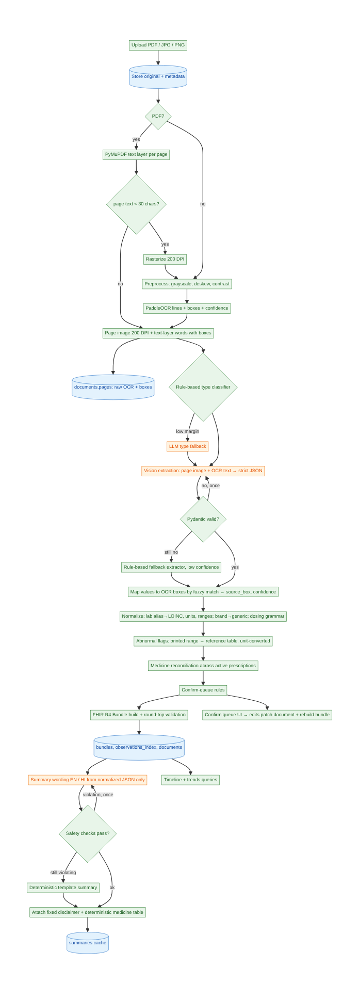

# ByteXL — your health records, explained

**Snap a lab report, prescription or discharge summary → get verified structured data, an ABDM-ready FHIR R4 record, a plain-language summary in English and Hindi, and one timeline of your health — all running locally, with no cloud APIs.**

Built for the Altrix Labs "AI-Powered Personal Health Copilot" hackathon (Round 1).

## Setup (≤ 10 commands)

Requires Python 3.11 and [Ollama](https://ollama.com). MongoDB is optional; without it ByteXL stores data as JSON files automatically.

```bash
git clone https://github.com/Yash-200608/ByteXL.git && cd ByteXL
python3.11 -m venv .venv && .venv/bin/pip install -r requirements.txt
cp .env.example .env
ollama pull qwen2.5vl:3b && ollama pull qwen2.5:7b
docker compose up -d mongo            # optional
make seed                             # demo patient + all files in samples/ (slow on CPU-only machines)
make api                              # terminal 1 → http://localhost:8000/docs
make ui                               # terminal 2 → http://localhost:8501
```

On a GPU machine set `VISION_MODEL=qwen2.5vl:7b` in `.env` for better accuracy. For an instant, LLM-free demo use
`EXTRACTION_MODE=rules SUMMARY_MODE=template make seed` (every field then lands in the confirm queue).

Other commands: `make test` (pytest), `make eval` (field-level accuracy), `make samples` (regenerate synthetic samples).

## Architecture



Green steps are deterministic Python, orange steps use a local LLM. The principle: **LLMs read and write words; Python decides facts.** Full design — schemas, normalization rules, FHIR mapping, Mongo collections, API contract, safety design — is in [docs/architecture.md](docs/architecture.md).

| Layer | Tech |
|---|---|
| Ingest & OCR | PyMuPDF text layer → 200 DPI raster + PaddleOCR (PP-OCRv5 mobile) with deskew/contrast |
| Extraction | Ollama `qwen2.5vl` (page image + OCR text) with JSON-schema-constrained output, Pydantic validation, one retry with error feedback, rules fallback |
| Normalization | 51 lab tests → LOINC + sex-specific ranges + unit conversion, 103 Indian brands → generics, Indian dosing grammar parser |
| Health record | FHIR R4 (`fhir.resources`, R4B wire-compatible) collection Bundle per upload, NRCeS profile tags, ABDM document-bundle export |
| Summary | `qwen2.5:7b` prose from validated JSON only, deterministic safety checks, template fallback |
| Store / API / UI | MongoDB or JSON files · FastAPI · Streamlit |

## Features

- **Upload anything common**: text PDFs, scanned PDFs, phone photos (JPG/PNG). Per-stage progress in the UI.
- **Automatic document type** (lab report / prescription / discharge summary): keyword rules with an LLM fallback.
- **Structured extraction with provenance**: every field has a confidence score and the exact box it came from on the page; tap a value to see the crop.
- **Indian prescriptions understood**: `1-0-1`, `½-0-½`, `OD/BD/TDS/QID`, `SOS`, `HS`, `AC/PC`, "empty stomach", "x 5 days", "for 1 week", "once a week", "continue" → structured schedule; brand → generic (Glycomet → metformin).
- **Lab values checked in Python**: printed reference range first, reference-table fallback by sex, mmol/L ↔ mg/dL conversion for glucose and lipids, low / normal / high / critical / unknown.
- **Confirm queue**: low-confidence fields, values not found on the page, flag mismatches, unrecognised tests/medicines, and *every* drug name and dose on handwritten prescriptions need one-tap confirmation. Edits rebuild the FHIR record, trends and summary.
- **Plain-language summary in English and Hindi** (English written by the local LLM under safety checks; Hindi composed from curated Hindi phrases by default): what the document is, key findings, out-of-range values and what they generally indicate, medicines and how to take them *as written*, questions to ask your doctor, fixed disclaimer.
- **Unified timeline and trends**: all documents chronologically; any test over time with the reference band shaded; current medicines with duplicate-medicine alerts ("Metformin appears on 2 of your documents — ask your doctor").
- **ABDM-ready**: mock ABHA number (Verhoeff-valid `91-XXXX-XXXX-XXXX`) and ABHA address on every patient, link-existing-ABHA flow, one-click FHIR export.

## Medical safety approach

1. **No LLM decides a fact.** Abnormal flags, units, ranges, dosing schedules, generic names and duplicate-medicine alerts are deterministic and unit-tested.
2. **Summaries come only from validated, normalized JSON** — never from images or raw OCR text.
3. **The LLM only writes prose.** Values, flags, medicine instructions, reconciliation notes and the disclaimer are inserted by code.
4. **Output policing**: no disease may be named unless the document itself states it; banned phrases in English and Hindi ("you have", "may indicate", "stop taking", "increase your dose", "cured", "guaranteed", "दवा बंद करें", …), every number and month must exist in the source data, every abnormal value must be covered, Hindi must be Devanagari. One regeneration, then a deterministic template.
5. **Fixed disclaimer** on every summary (EN + HI): not a diagnosis, do not start/stop/change any medicine, talk to your doctor.
   Real example from this repo's seed run: the first draft for the March lab report said *"Fasting blood sugar and HbA1c are high, suggesting possible diabetes or pre-diabetes"*; the checker rejected it (inference phrase + condition not stated in the document) and the regenerated, accepted line reads *"Fasting blood sugar and HbA1c are high."*
6. **Hallucination guard**: an extracted value that cannot be found in the OCR text gets low confidence and goes to the confirm queue; handwritten drug names and doses are always confirmed.

## ABDM readiness

- FHIR R4 resources: Patient (ABHA number + address identifiers), Practitioner (registration no.), Organization, Encounter (AMB/IMP), DiagnosticReport, Observation (LOINC, UCUM, referenceRange, interpretation), MedicationRequest (dosageInstruction.timing with EventTiming codes, boundsDuration, asNeeded), Condition, DocumentReference.
- `meta.profile` points at NRCeS ABDM profiles; `GET /documents/{id}/fhir?profile=abdm` wraps a bundle as an ABDM `document` Bundle with a Composition (DiagnosticReportRecord / PrescriptionRecord / DischargeSummaryRecord).
- Deterministic resource ids let `GET /patients/{id}/export` merge all records with one Patient and de-duplicated practitioners/organizations.
- Mongo collections: `patients`, `documents`, `bundles`, `observations_index`, `summaries` (see architecture §5).

## Evaluation

`make eval` scores field-level precision/recall against `samples/expected/*.json` (hand-filled ground truth; files still empty are skipped) and writes [docs/eval_results.md](docs/eval_results.md). The bundled samples are synthetic, generated by `scripts/make_samples.py`, which also writes their ground truth to `tests/fixtures/synthetic_truth/`:

```bash
.venv/bin/python scripts/eval.py --expected-dir tests/fixtures/synthetic_truth
```

Results on the five bundled synthetic samples with the default local models (`qwen2.5vl:3b` vision at 1024 px, CPU-only, 4 vCPU):

| Document | Path | Fields | Precision | Recall | F1 | Time |
|---|---|---|---|---|---|---|
| Lab report, text PDF | text layer | 56 | 1.00 | 1.00 | 1.00 | 371 s |
| Lab report, phone photo (skewed) | OCR | 48 | 0.98 | 0.98 | 0.98 | 375 s |
| Discharge summary, scanned PDF | OCR | 52 | 0.91 | 0.92 | 0.91 | 482 s |
| Prescription, printed photo | OCR | 37 | 0.97 | 0.97 | 0.97 | 269 s |
| Prescription, handwriting-style | OCR | 34 | 0.94 | 0.97 | 0.96 | 270 s |
| **Overall (micro)** | | **227** | **0.96** | **0.97** | **0.96** | |

Document type was classified correctly for all five. Full field-level error list: [docs/eval_results.md](docs/eval_results.md). These are synthetic documents, so expect lower numbers on real photos and real handwriting — fill `samples/expected/` for your own files and rerun `make eval`.

## API

Interactive docs at `http://localhost:8000/docs`. Main endpoints: `POST /patients`, `POST /patients/{id}/abha/link`, `POST /patients/{id}/documents`, `GET /documents/{id}`, `GET /documents/{id}/fhir`, `GET /documents/{id}/summary?lang=en|hi`, `POST /documents/{id}/confirm`, `GET /patients/{id}/timeline`, `GET /patients/{id}/trends/{loinc}`, `GET /patients/{id}/medications`, `GET /patients/{id}/export`, `GET /health`.

## Limitations

- **Speed on CPU-only machines**: with no GPU, one page takes ~4–8 minutes (vision prompt evaluation dominates); on a GPU it is seconds. OCR alone is ~20 s/page on CPU.
- Samples are synthetic (fictional patient and facilities); real-world handwriting is far harder than the handwriting-style font used here.
- Adult reference ranges only; paediatric and pregnancy ranges are out of scope (the printed range is used if present, otherwise the flag is "unknown").
- Lab table has 51 tests and the brand table 103 brands; unknown items are kept as written and sent to the confirm queue. A larger `data/reference/medicines_extended.csv` is merged automatically.
- ABHA numbers are mock values; there is no real ABDM gateway integration (consent, HIP/HIU flows).
- FHIR uses the R4B Python models, which are wire-compatible with R4 for the resources used; bundles have not been run through the official NRCeS validator.
- Hindi summaries use a deterministic Hindi composer by default (curated phrases, same structure) because the 7B model's Hindi was unreliable on test hardware; set `HINDI_SUMMARY_MODE=llm` to have the LLM write Hindi under the same safety checks.
- Hindi OCR (Devanagari) is optional (`OCR_HINDI=true`) and was not part of the evaluated samples.
