# ByteXL — Architecture

ByteXL turns a photo or PDF of an Indian medical document (lab report, prescription, discharge summary) into
validated structured data, an ABDM-aligned FHIR R4 Bundle, a plain-language summary in English and Hindi, and a
unified patient timeline. Everything runs locally: PaddleOCR for text, Ollama (`qwen2.5vl:7b` vision, `qwen2.5:7b`
text) for extraction and wording, MongoDB (or a JSON-file fallback) for storage.

Design principle: **LLMs read and write words; Python decides facts.** The vision model transcribes a document into
a strict schema. Every clinically meaningful decision — units, reference ranges, abnormal flags, dosing schedule,
generic names, duplicate-medicine detection, confirmation rules, FHIR coding — is deterministic, table-driven and
unit-tested. The text model only phrases a summary from already-validated JSON, and its output is policed.

---

## 1. Pipeline

```mermaid
flowchart TD
    classDef det fill:#e8f5e9,stroke:#2e7d32,color:#1b5e20
    classDef llm fill:#fff3e0,stroke:#ef6c00,color:#e65100
    classDef store fill:#e3f2fd,stroke:#1565c0,color:#0d47a1

    U[Upload PDF / JPG / PNG]:::det --> S0[(Store original + metadata)]:::store
    S0 --> P{PDF?}:::det
    P -- yes --> TL[PyMuPDF text layer per page]:::det
    TL --> C30{page text < 30 chars?}:::det
    C30 -- no --> PG[Page image 200 DPI + text-layer words with boxes]:::det
    C30 -- yes --> RS[Rasterize 200 DPI]:::det
    P -- no --> PRE[Preprocess: grayscale, deskew, contrast]:::det
    RS --> PRE
    PRE --> OCR[PaddleOCR lines + boxes + confidence]:::det
    OCR --> PG
    PG --> S1[(documents.pages: raw OCR + boxes)]:::store
    PG --> CL{Rule-based type classifier}:::det
    CL -- low margin --> CLL[LLM type fallback]:::llm
    CL --> EX
    CLL --> EX[Vision extraction: page image + OCR text → strict JSON]:::llm
    EX --> V{Pydantic valid?}:::det
    V -- no, once --> EX
    V -- still no --> LC[Rule-based fallback extractor, low confidence]:::det
    V -- yes --> MB
    LC --> MB[Map values to OCR boxes by fuzzy match → source_box, confidence]:::det
    MB --> N[Normalize: lab alias→LOINC, units, ranges; brand→generic; dosing grammar]:::det
    N --> F[Abnormal flags: printed range → reference table, unit-converted]:::det
    F --> R[Medicine reconciliation across active prescriptions]:::det
    R --> Q[Confirm-queue rules]:::det
    Q --> FH[FHIR R4 Bundle build + round-trip validation]:::det
    FH --> S2[(bundles, observations_index, documents)]:::store
    S2 --> SM[Summary wording EN / HI from normalized JSON only]:::llm
    SM --> G{Banned phrases? numbers grounded? abnormal values covered?}:::det
    G -- violation, once --> SM
    G -- still violating --> T[Deterministic template summary]:::det
    G -- ok --> D[Attach fixed disclaimer + deterministic medicine table]:::det
    T --> D
    D --> S3[(summaries cache)]:::store
    S2 --> TLN[Timeline + trends queries]:::det
    Q --> CQ[Confirm queue UI → edits patch document + rebuild bundle]:::det
```



Legend: green = deterministic Python, orange = LLM step, blue = persistence.

Stage list (the `status.stage` value the UI polls): `stored → ocr → classify → extract → normalize → fhir → summarize → done` (or `failed` with a user-safe message).

---

## 2. Extraction schemas (Pydantic v2)

All coordinates are pixels on the stored page image (200 DPI raster for scanned/image pages; text-layer PDF
coordinates are scaled to the same 200 DPI raster so the UI can crop uniformly).

```python
class SourceBox(BaseModel):
    page: int                    # 0-based page index
    x0: float; y0: float; x1: float; y1: float

class Field(BaseModel, Generic[T]):
    value: T | None = None
    confidence: float = 0.0      # 0..1, computed deterministically (see §8)
    source_box: SourceBox | None = None
    needs_confirmation: bool = False
    confirmed: bool = False
    reasons: list[str] = []      # why it needs confirmation

class PatientInfo(BaseModel):
    name: Field[str]; age_years: Field[int]; sex: Field[str]   # "male" | "female" | "other"
    identifier: Field[str]       # UHID / lab patient id as printed

class LabResult(BaseModel):
    test_name: Field[str]        # as printed
    value: Field[float]          # numeric result
    value_text: Field[str]       # qualitative result ("Nil", "Trace", "Positive")
    unit: Field[str]
    reference_range: Field[str]  # printed interval, verbatim
    printed_flag: Field[str]     # "H"/"L" as printed — transcription only, never used as the flag
    normalized: NormalizedLab | None

class NormalizedLab(BaseModel):
    canonical_name: str | None; loinc: str | None; panel: str | None
    value: float | None; unit: str | None          # canonical unit after conversion
    ref_low: float | None; ref_high: float | None
    range_source: Literal["printed", "reference_table", "none"]
    flag: Literal["low", "normal", "high", "critical", "unknown"]
    conversion: str | None                          # e.g. "mmol/L→mg/dL ×18.016"

class Dosage(BaseModel):
    morning: float = 0; afternoon: float = 0; night: float = 0
    frequency: int | None        # administrations per period
    period: float = 1; period_unit: Literal["h", "d", "wk", "mo"] = "d"
    as_needed: bool = False
    when: list[str] = []         # FHIR event-timing codes: MORN, AFT, NIGHT, HS, AC, PC, ACM, ...
    duration_value: float | None; duration_unit: Literal["d", "wk", "mo"] | None
    continue_indefinitely: bool = False
    text: str                    # canonical human-readable sig

class MedicationItem(BaseModel):
    name: Field[str]             # as written, brand or generic ("Tab Glycomet 500")
    form: Field[str]             # tablet / capsule / syrup / injection / sachet ...
    strength: Field[str]         # "500 mg"
    dosage: Field[str]           # raw sig as written: "1-0-1", "BD", "OD AC"
    timing: Field[str]           # food / time instruction as written: "after food", "HS"
    duration: Field[str]         # as written: "x 30 days", "for 1 week"
    instructions: Field[str]
    normalized: NormalizedMedication | None

class NormalizedMedication(BaseModel):
    brand: str | None; generic: str | None; strength: str | None; form: str | None
    matched: bool; match_score: float
    dosage: Dosage | None

class LabReport(BaseModel):
    document_type: Literal["lab_report"]
    patient: PatientInfo
    facility: Field[str]; referring_doctor: Field[str]; pathologist: Field[str]
    collected_on: Field[date]; reported_on: Field[date]
    results: list[LabResult]
    meta: ExtractionMeta

class Prescription(BaseModel):
    document_type: Literal["prescription"]
    patient: PatientInfo
    prescriber: Field[str]; prescriber_registration: Field[str]; facility: Field[str]
    date: Field[date]
    complaints: list[Field[str]]; diagnoses: list[Field[str]]
    medications: list[MedicationItem]
    advice: list[Field[str]]; follow_up: Field[str]
    is_handwritten: bool
    meta: ExtractionMeta

class DischargeSummary(BaseModel):
    document_type: Literal["discharge_summary"]
    patient: PatientInfo
    facility: Field[str]; attending_doctor: Field[str]
    admission_date: Field[date]; discharge_date: Field[date]
    diagnoses: list[Field[str]]; presenting_complaints: list[Field[str]]
    hospital_course: Field[str]; procedures: list[Field[str]]
    investigations: list[LabResult]
    discharge_medications: list[MedicationItem]
    follow_up: Field[str]; advice: list[Field[str]]
    meta: ExtractionMeta

class ExtractionMeta(BaseModel):
    model: str; attempts: int; method: Literal["vision", "text", "rules"]
    validation_errors: list[str]; low_confidence: bool; duration_s: float
```

The LLM never sees these wrapper types. It fills a flat **LLM-facing schema** per type (`LabReportLLM`,
`PrescriptionLLM`, `DischargeSummaryLLM` in `app/extract/llm_schemas.py`, plain strings and numbers), which Ollama
receives as a JSON-schema `format` constraint. The validated raw object is then lifted into the domain schema above
and confidence/boxes are added deterministically. This keeps the prompt small (CPU inference) and removes any chance
of the model inventing confidences.

---

## 3. Normalization spec

### 3.1 Indian dosing grammar → `Dosage`

| Pattern (case-insensitive) | morning-aft-night | frequency/day | when | notes |
|---|---|---|---|---|
| `1-0-1`, `1-1-1`, `0-0-1`, `1-0-0`, `0-1-0`, `½-0-½`, `1/2-0-1/2`, `2-0-2` | parsed slots | sum of non-zero slots | MORN / AFT / NIGHT for non-zero slots | `1-1-1-1` → 4 slots (QID) |
| `OD`, `once daily`, `once a day`, `1 OD` | — | 1 | — | |
| `BD`, `BID`, `twice daily` | 1-0-1 | 2 | MORN, NIGHT | |
| `TDS`, `TID`, `thrice daily` | 1-1-1 | 3 | MORN, AFT, NIGHT | |
| `QID`, `QDS`, `four times a day` | — | 4 | — | |
| `SOS`, `PRN`, `as needed`, `when required` | — | — | — | `as_needed=True` |
| `HS`, `at bedtime`, `bedtime` | 0-0-1 if no slots | 1 | HS | |
| `AC`, `before food/meals`, `empty stomach` | — | — | AC | `before breakfast` → ACM |
| `PC`, `after food/meals` | — | — | PC | `after breakfast` → PCM |
| `once a week`, `weekly`, `once weekly` | — | 1 | — | `period=1, period_unit=wk` |
| `stat` | — | 1 | — | single dose, `duration=1 d` |
| `x 5 days`, `x5d`, `for 5 days`, `5 days` | — | — | — | `duration=5 d` |
| `x 2 wks`, `for 1 week`, `x 8 weeks` | — | — | — | `duration in wk` |
| `x 1 month`, `for 3 months`, `x 1 mo` | — | — | — | `duration in mo` |
| `continue`, `to continue`, `long term` | — | — | — | `continue_indefinitely=True` |

Slot numbers win over abbreviations when both are present; an abbreviation that contradicts the slot count adds a
confirmation reason. Output `text` is regenerated from the structure (“1 in the morning, 1 at night · after food ·
for 30 days”) so the UI and summary never re-interpret the raw string.

### 3.2 Brand → generic

`data/reference/medicines.csv` (`brand,generic,strength,form,drug_class`) — 50+ common Indian brands
(Glycomet → metformin, Dolo → paracetamol, Telma → telmisartan, Pan → pantoprazole …). Lookup: strip form prefix
(`Tab`, `Cap`, `Syp`, `Inj`, `Sach`), strip strength, normalize case/punctuation, then exact match → RapidFuzz
`WRatio ≥ 88` match. A larger CSV at `data/reference/medicines_extended.csv` is merged automatically if present.
Unmatched names stay as written with `matched=False` and enter the confirm queue.

### 3.3 Lab alias → canonical → LOINC → reference range

`data/reference/lab_tests.csv` columns:
`canonical_name, aliases (|-separated), loinc, panel, unit, alt_units, low_male, high_male, low_female, high_female, critical_low, critical_high, low_meaning, high_meaning, low_meaning_hi, high_meaning_hi`.

Resolution: normalize printed name (lowercase, strip punctuation, `serum`/`blood`/`total` handled as aliases) →
exact alias match → RapidFuzz `token_sort_ratio ≥ 90`. Reference ranges are adult ranges by sex; age < 18 sets
`range_source="none"` when no printed range exists (paediatric ranges are out of scope).

### 3.4 Unit conversions

| Analyte | From | To | Factor |
|---|---|---|---|
| Glucose (FBS, PPBS, RBS) | mmol/L | mg/dL | × 18.016 |
| Total / LDL / HDL cholesterol | mmol/L | mg/dL | × 38.67 |
| Triglycerides | mmol/L | mg/dL | × 88.57 |
| Creatinine | µmol/L | mg/dL | ÷ 88.42 |
| Haemoglobin | g/L | g/dL | ÷ 10 |
| Platelets / TLC | lakh/cumm, 10^3/µL, /cumm | cells/µL | table-driven multipliers |

Unit strings are normalized first (`mg/dl`, `mg %` → `mg/dL`; `umol/l`, `µmol/L` → `µmol/L`; `uIU/ml`, `µIU/mL`,
`mIU/L` → `µIU/mL`).

### 3.5 Abnormal flag (Python only)

1. Parse printed interval: `a - b`, `a–b`, `< b`, `<= b`, `> a`, `>= a`, `upto b`, `b max`. If parseable and in the
   same unit as the value → use it (`range_source="printed"`).
2. Else reference table range for the patient's sex (both-sex union if sex unknown), with the value converted to
   the table unit (`range_source="reference_table"`).
3. `value < critical_low or > critical_high` → `critical`; `< low` → `low`; `> high` → `high`; else `normal`.
   No usable range or non-numeric value → `unknown`.
4. Printed `H`/`L` that disagrees with the computed flag adds a confirmation reason (OCR/extraction error guard).

### 3.6 Medicine reconciliation

Across all **active** medications of a patient (prescription date + duration ≥ today, or `continue_indefinitely`, or
no duration and issued in the last 90 days), group by `generic`. A generic appearing on more than one document emits
a reconciliation note: “*Metformin appears on 2 prescriptions (Glycomet 500 mg on 15 Mar 2024, Glycomet 500 on 22
Sep 2024). Ask your doctor whether both should be taken.*” Never says to stop or change anything.

---

## 4. FHIR R4 mapping

Library: `fhir.resources` 7.x, R4B module (`fhir.resources.R4B`). R4B is wire-compatible with R4 4.0.1 for every
resource used here; the Bundle validates by round-trip parsing (`Bundle.model_validate(json)`). One `collection`
Bundle per upload, `Bundle.identifier = urn:bytexl:document:<document_id>`. Each entry has
`fullUrl = urn:uuid:<uuid>` and references use those URNs.

| Source field | FHIR resource.path |
|---|---|
| patient.name | Patient.name[0].text |
| patient.sex | Patient.gender (male/female/other/unknown) |
| patient.age_years + document date | Patient.birthDate (year only, approximated; extension-free) |
| ABHA number (mock, `XX-XXXX-XXXX-XXXX`) | Patient.identifier[0] system `https://healthid.ndhm.gov.in`, type `MR`-coded “ABHA” |
| ABHA address (`name@abdm`) | Patient.identifier[1] system `https://healthid.ndhm.gov.in/health-id` |
| patient.identifier (UHID / lab id) | Patient.identifier[2] system `urn:bytexl:facility-patient-id` |
| referring_doctor / prescriber / attending_doctor / pathologist | Practitioner.name[0].text, Practitioner.identifier (registration no., system `https://doctor.ndhm.gov.in`) |
| facility (lab / clinic / hospital) | Organization.name |
| discharge admission/discharge dates | Encounter.class=IMP, Encounter.period.start/end, Encounter.serviceProvider, Encounter.participant |
| prescription visit | Encounter.class=AMB, Encounter.period.start = prescription date |
| lab report | DiagnosticReport.status=final, .code (LOINC 11502-2 “Laboratory report”), .subject, .effectiveDateTime = collected_on, .issued = reported_on, .performer (Organization, pathologist), .result[] → Observations |
| LabResult | Observation.status=final, .category=laboratory, .code.coding[LOINC] + .code.text (printed name), .valueQuantity (value, unit, UCUM system), .valueString for qualitative |
| NormalizedLab ref_low/ref_high | Observation.referenceRange[0].low/high (+ .text = printed range) |
| NormalizedLab.flag | Observation.interpretation (v3-ObservationInterpretation: L, N, H, LL/HH for critical) |
| MedicationItem | MedicationRequest.status=active, .intent=order, .medicationCodeableConcept.text (as written) + coding (generic, system `urn:bytexl:generic`), .requester, .authoredOn, .encounter |
| Dosage | MedicationRequest.dosageInstruction[0].text, .timing.repeat.frequency/period/periodUnit, .timing.repeat.when, .timing.repeat.boundsDuration, .asNeededBoolean, .doseAndRate.doseQuantity (per slot) |
| diagnoses / complaints | Condition.code.text, .category (encounter-diagnosis / problem-list-item), .subject, .encounter, .recordedDate |
| uploaded file | DocumentReference.status=current, .type (LOINC 11502-2 / 57833-6 / 18842-5), .content.attachment (contentType, url `/documents/<id>/file`, title, hash), .context.encounter, .subject |
| documents per type | Composition (optional, see below) |

LOINC document type codes: lab report `11502-2`, prescription `57833-6`, discharge summary `18842-5`.

**NRCeS / ABDM alignment.** NRCeS publishes ABDM FHIR profiles (FHIR R4 4.0.1) for the HI types
`DiagnosticReportRecord`, `PrescriptionRecord`, `DischargeSummaryRecord`. Those are `document` Bundles whose first
entry is a `Composition`. ByteXL emits a `collection` Bundle (as specified for this build) but uses exactly the
resource set, codes and reference structure of those profiles, and stamps each resource with
`meta.profile = https://nrces.in/ndhm/fhir/r4/StructureDefinition/<Resource>`. Converting to an ABDM `document`
Bundle is a deterministic wrap: add a `Composition` (type = the LOINC code above, section entries = the existing
resources), set `Bundle.type = document`, add `Bundle.timestamp`. `app/fhir/abdm.py::to_document_bundle` does this
for the export endpoint’s `?profile=abdm` option.

Patient export: `GET /patients/{id}/export` merges all document bundles into one `collection` Bundle with a single
Patient resource and deduplicated Practitioner/Organization entries.

---

## 5. MongoDB collections

Database `bytexl`. The JSON-file fallback (`data/store/<collection>/<id>.json`) implements the same repository
interface and is selected automatically when Mongo is unreachable at startup.

**patients**
```json
{"_id": "pat_7f3a…", "name": "Rahul Sharma", "sex": "male", "birth_year": 1979,
 "abha_number": "91-4821-7730-2264", "abha_address": "rahul.sharma@abdm", "abha_linked": false,
 "created_at": "2024-03-12T10:00:00Z"}
```

**documents**
```json
{"_id": "doc_1c2d…", "patient_id": "pat_7f3a…", "filename": "lab_report_2024_03.pdf",
 "content_type": "application/pdf", "sha256": "…", "path": "data/uploads/doc_1c2d….pdf",
 "status": {"stage": "done", "message": null, "timings": {"ocr": 2.1, "extract": 74.3}},
 "document_type": "lab_report", "classification": {"method": "rules", "scores": {"lab_report": 9, "prescription": 1}},
 "pages": [{"index": 0, "width": 1654, "height": 2339, "image_path": "data/pages/doc_1c2d…_0.png",
            "source": "text_layer", "lines": [{"text": "Haemoglobin 12.1 g/dL 13.0 - 17.0 L",
            "confidence": 1.0, "box": [111, 500, 1350, 528]}]}],
 "extraction": {"document_type": "lab_report", "results": [{"test_name": {"value": "Haemoglobin",
   "confidence": 0.97, "source_box": {"page": 0, "x0": 111, "y0": 500, "x1": 300, "y1": 528}}, "…": "…"}]},
 "document_date": "2024-03-12", "confirm_queue": [{"path": "results.0.value", "reasons": ["printed flag mismatch"]}],
 "bundle_id": "bun_…", "created_at": "…", "updated_at": "…"}
```

**bundles**
```json
{"_id": "bun_…", "document_id": "doc_1c2d…", "patient_id": "pat_7f3a…", "version": 2,
 "bundle": {"resourceType": "Bundle", "type": "collection", "entry": ["…"]}, "created_at": "…"}
```

**observations_index** (flat, one row per numeric result, rebuilt on confirm)
```json
{"_id": "obs_…", "patient_id": "pat_7f3a…", "document_id": "doc_1c2d…", "loinc": "4548-4",
 "name": "HbA1c", "value": 7.2, "unit": "%", "date": "2024-03-12", "flag": "high",
 "ref_low": 4.0, "ref_high": 5.6}
```

**summaries**
```json
{"_id": "doc_1c2d…:en", "document_id": "doc_1c2d…", "lang": "en", "source_hash": "…",
 "method": "llm" , "attempts": 1, "summary": {"what_this_is": "…", "key_findings": ["…"],
 "out_of_range": [{"name": "HbA1c", "value": "7.2 %", "flag": "high", "meaning": "…"}],
 "medicines": [], "questions": ["…"], "notes": ["…"], "disclaimer": "…"}, "created_at": "…"}
```
`source_hash` is the hash of the normalized extraction; a confirm edit changes it and invalidates the cache.

---

## 6. API contract

| Method | Path | Body / query | Response |
|---|---|---|---|
| GET | `/health` | — | `{status, store: "mongo"\|"json", ollama: bool, models: {vision, text, available: [...]}, ocr: bool}` |
| POST | `/patients` | `{name, sex?, birth_year?}` | `201 Patient` (mock ABHA number + address generated) |
| GET | `/patients` | — | `[Patient]` |
| GET | `/patients/{id}` | — | `Patient` |
| POST | `/patients/{id}/abha/link` | `{abha_number, abha_address?}` | `Patient` (format-validated, `abha_linked=true`) |
| POST | `/patients/{id}/documents` | multipart `file`, `?sync=false` | `202 {document_id, status}`; with `sync=true` → `201 Document` after the full pipeline |
| GET | `/patients/{id}/documents` | — | `[DocumentSummary]` |
| GET | `/documents/{id}` | — | `{id, status, document_type, extraction (fields with value, confidence, source_box), confirm_queue, pages meta}` |
| GET | `/documents/{id}/file` | — | original file |
| GET | `/documents/{id}/pages/{n}` | — | page PNG (200 DPI) for crops |
| GET | `/documents/{id}/fhir` | — | FHIR Bundle (collection) |
| GET | `/documents/{id}/summary` | `?lang=en\|hi` | `{lang, method, summary sections, markdown, disclaimer}` |
| POST | `/documents/{id}/confirm` | `{items: [{path, action: "accept"\|"edit", value?}]}` | updated `Document`; re-normalizes, rebuilds bundle + index, drops cached summaries |
| GET | `/patients/{id}/timeline` | `?type=` | `[{date, document_id, document_type, title, highlights, abnormal_count}]` sorted by date |
| GET | `/patients/{id}/trends/{loinc}` | — | `{loinc, name, unit, ref_low, ref_high, points: [{date, value, flag, document_id}]}` |
| GET | `/patients/{id}/medications` | — | `{active: [...], reconciliation_notes: [...]}` |
| GET | `/patients/{id}/export` | `?profile=collection\|abdm` | merged FHIR Bundle |

Errors: `404 {detail}` unknown ids, `415` unsupported file type, `422` validation, `503` when a stage needs Ollama and
it is unreachable (the document is stored and can be retried with `POST /documents/{id}/retry`).

---

## 7. Summary safety design

1. **Input is validated JSON only.** The summary prompt receives the normalized extraction (names, values, units,
   computed flags, curated `low_meaning`/`high_meaning` text from the reference table) — never images or OCR text.
2. **LLM writes only prose sections**: `what_this_is`, `key_findings`, per-abnormal-value `meaning`, `questions`.
   Medicine instructions are rendered deterministically from the parsed `Dosage` (“how to take them as written”),
   values/units/flags are injected from data, and the disclaimer is fixed text appended by code.
3. **Output checks** (all deterministic):
   - Pydantic validation of the section JSON.
   - Banned-phrase filter (case-insensitive, word-boundary) over every LLM-written string.
   - Number grounding: every number in LLM prose must appear in the source JSON.
   - Coverage: every abnormal (`low`/`high`/`critical`) result appears in `out_of_range`.
   - Violation → regenerate once with the violations listed; still violating → deterministic template summary.
4. **Hindi** is generated directly in Hindi with the same structure; medicine names, numbers and units are kept
   unchanged (checked by grounding); the Hindi disclaimer is fixed text.

**Banned phrases (English):** `you have`, `you are suffering`, `you suffer from`, `you are diagnosed`,
`diagnosed with`, `this confirms`, `this means you have`, `you should stop`, `stop taking`, `stop the`,
`discontinue`, `increase your dose`, `increase the dose`, `decrease your dose`, `reduce your dose`, `reduce the dose`,
`double the dose`, `skip your dose`, `skip the dose`, `change your dose`, `you should take`, `you must take`,
`you need to take`, `start taking`, `cured`, `cure`, `guaranteed`, `guarantee`, `definitely`, `100%`,
`no need to see`, `don't need a doctor`, `do not need a doctor`, `instead of your doctor`, `safe to stop`,
`nothing to worry`, `not serious`, `is serious`, `emergency treatment`.

**Banned phrases (Hindi):** `आपको बीमारी है`, `आपको यह बीमारी है`, `आप पीड़ित हैं`, `दवा बंद करें`, `दवा बंद कर दें`,
`दवा लेना बंद`, `खुराक बढ़ाएं`, `खुराक बढ़ा दें`, `खुराक कम करें`, `खुराक कम कर दें`, `गारंटी`, `पूरी तरह ठीक`,
`इलाज पक्का`, `डॉक्टर की ज़रूरत नहीं`, `डॉक्टर की जरूरत नहीं`, `चिंता की कोई बात नहीं`.

**Disclaimer (English, fixed):**
> This summary was generated by software to help you understand your document. It is not a diagnosis or medical
> advice. Do not start, stop or change any medicine because of it. Please discuss your results with your doctor.

**Disclaimer (Hindi, fixed):**
> यह सारांश सॉफ़्टवेयर द्वारा आपके दस्तावेज़ को समझने में मदद के लिए बनाया गया है। यह कोई निदान या चिकित्सा सलाह
> नहीं है। इसके आधार पर कोई भी दवा शुरू, बंद या बदलें नहीं। कृपया अपने परिणामों पर अपने डॉक्टर से बात करें।

---

## 8. Confidence and confirm queue

Field confidence is computed, never self-reported by the model:

```
match   = best RapidFuzz partial_ratio of the field value against OCR lines (0..1)
ocr     = confidence of the matched OCR line (text layer = 1.0)
conf    = 0.55·match + 0.45·ocr                 if match ≥ 0.80
        = 0.35                                  if value not found in OCR text
conf   ×= 0.85                                  if extraction needed the retry
conf    = min(conf, 0.30)                       if extraction fell back to rules / low_confidence
```

| Band | Range | UI treatment |
|---|---|---|
| High | ≥ 0.85 | plain |
| Medium | 0.60 – 0.85 | amber highlight, editable |
| Low | < 0.60 | red highlight, **confirm queue** |

Always queued regardless of confidence:
- **Handwritten prescription: every medication `name` and `dosage`** (handwritten = LLM `is_handwritten` OR mean OCR
  line confidence < 0.90 on a non-text-layer page).
- Lab result whose printed `H`/`L` disagrees with the computed flag.
- Lab result with flag `critical`.
- Lab test that did not resolve to a LOINC code.
- Medicine that did not resolve to a generic.
- Dosage string the parser could not fully parse, or whose slots contradict its abbreviation.
- Any field whose value was not found in the OCR text (possible hallucination).

Accepting sets `confirmed=true, confidence=1.0`; editing stores `original_value`, sets the new value, re-runs
normalization, rebuilds the FHIR bundle and observations index, and invalidates cached summaries.

---

## 9. Evaluation

`samples/expected/<sample>.json` holds hand-written ground truth in a flat shape (plain values, no confidence):

```json
{"document_type": "lab_report",
 "patient": {"name": "", "age_years": null, "sex": ""},
 "facility": "", "referring_doctor": "", "collected_on": "", "reported_on": "",
 "results": [{"test_name": "", "value": null, "unit": "", "reference_range": ""}]}
```

`scripts/eval.py` flattens expected and predicted into `path → value` pairs. List items are aligned by key
(lab: canonical name of `test_name`; medicines: normalized `name`) with Hungarian-free greedy best-match. Field
comparison: numbers equal within 1 %; dates equal after parsing; strings equal after case/space/punctuation folding
or RapidFuzz ratio ≥ 90. Per document: precision = correct / predicted non-empty, recall = correct / expected
non-empty, F1. Files whose expected JSON has no non-empty value are skipped. Output: console table +
`docs/eval_results.md`. `--expected-dir` lets the same script score against the synthetic ground truth emitted by
`scripts/make_samples.py` into `tests/fixtures/synthetic_truth/`.

---

## 10. Risks and fallbacks

| Risk | Mitigation / fallback |
|---|---|
| CPU-only vision inference too slow (> 90 s/page) | Resize page to ≤ 1280 px; JSON-schema-constrained decoding; switch `VISION_MODEL` to `qwen2.5vl:3b` (logged); `EXTRACTION_MODE=text` sends OCR text to `qwen2.5:7b` instead |
| Ollama unreachable / model missing | `/health` reports it; upload still stores + OCRs; rule-based extractor produces low-confidence results so the timeline still works; `POST /documents/{id}/retry` |
| Hallucinated values | Every value is fuzzy-matched to OCR text; unmatched → confirm queue; flags and ranges never from the LLM |
| OCR errors on photos | Deskew, contrast stretch, 200 DPI; low line confidence lowers field confidence |
| Handwriting | Always-confirm rule for drug name + dosage; brand fuzzy match to the medicines table |
| Wrong document type | Rules with score margin; LLM fallback; type is editable in the confirm flow |
| Unsafe summary wording | Banned phrases, number grounding, coverage check, one regeneration, deterministic template fallback, fixed disclaimer |
| MongoDB unavailable | Automatic JSON-file store with the same interface |
| Unit mismatches (mmol/L vs mg/dL) | Unit normalization + conversion tables before flagging; unknown unit → flag `unknown`, not a guess |
| Paediatric / pregnancy ranges | Out of scope: printed range used if present, else flag `unknown` |
| FHIR invalidity | Round-trip parse in tests and at build time; failures block the bundle write and are logged |
